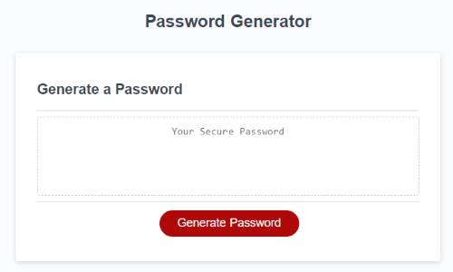
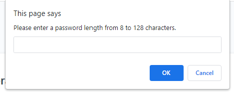
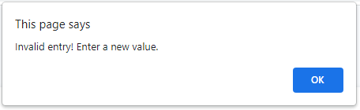
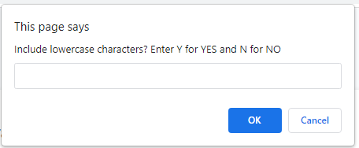
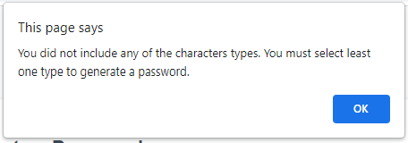
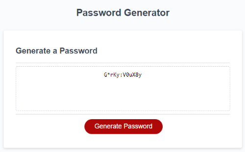

# Password Generator

## Description

In today's age of advanced technology it has become easier for hackers to gain access to sensitive data. For this reason, many employers require their employees who may access sensitive data to create secure passwords. This will make it more difficult for the data to be access by unwanted or unintended parties.

Given a webpage that was built with HTML and CSS, the associated JavaScript code should display a password when a button is clicked. Using the JavaScript skills I have developed so far, I added code so that when the button is clicked, a secure password is created based on user selected criteria, and is displayed on the webpage. 

## Installation

N/A

## Usage

To generate a secure password, the user is asked a series of questions to determine the length of the password and whether any particular character types should be included. The password can be anywhere from 8 to 128 characters in length and the character type choices are uppercase, lowercase, numeric and special characters.

Variables, objects, conditional statments, for-loops, functions and other JavaScript tools were leveraged to ask the user to make selections, perform validations, and use the selected criteria to create a randomly generated password.

The deployed application can be found [here](https://amaragh.github.io/password-generator/).

The below screenshot shows the landing page the user sees when they initially load the page.

When the user clicks the "Generate Password" button, they are first prompted for the length of the password.

If an invalid number is entered, that is, less than 8 or greater than 128, the user is alerted that they need to try again. 

Once the user enters a valid value for the password length, they are prompted to include or exclude each of the 4 different character types. One example prompt is below.

If the user opts to exclude all character types, they are met with an alert that they need to select at least one character type.

Once the user passes through the character selection successfully, the generated password is displayed on the page. In the below example, the user entered 12 for the password length, and all 4 characters types were selected for inclusion.

## Credits

While creating the `passwordGenerator()` function, I referenced [this](https://stackoverflow.com/questions/19743124/java-password-generator) post on stackoverflow.com for help with determining the logic for creating the password once all criteria were collected. 

## License

Please refer to the license in the repo.

